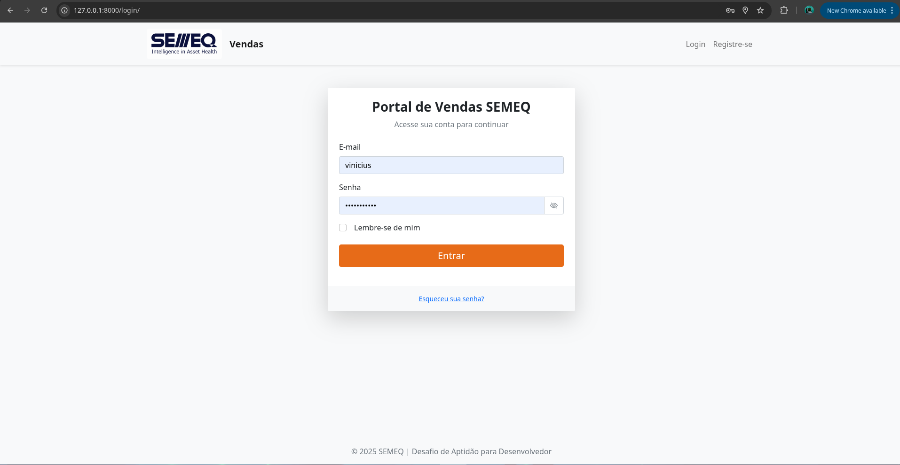
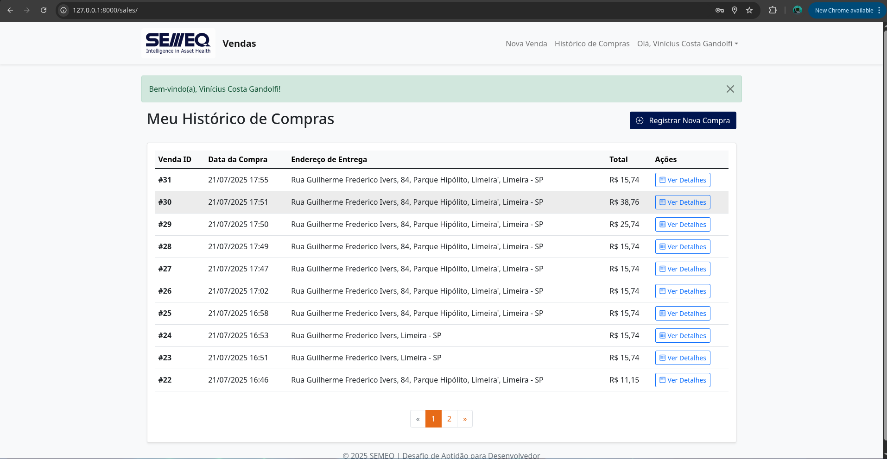
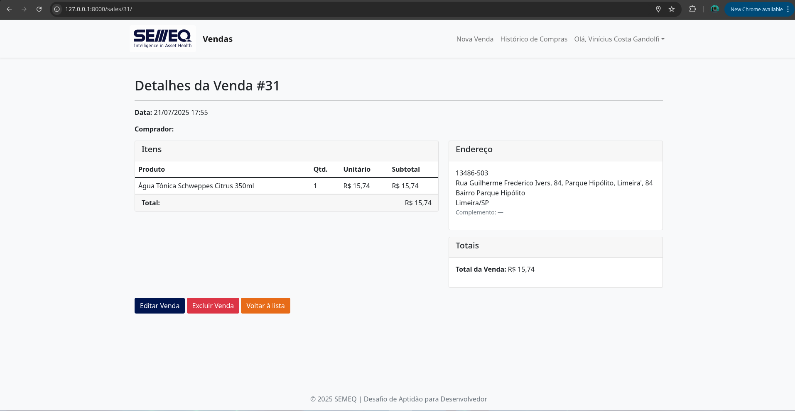
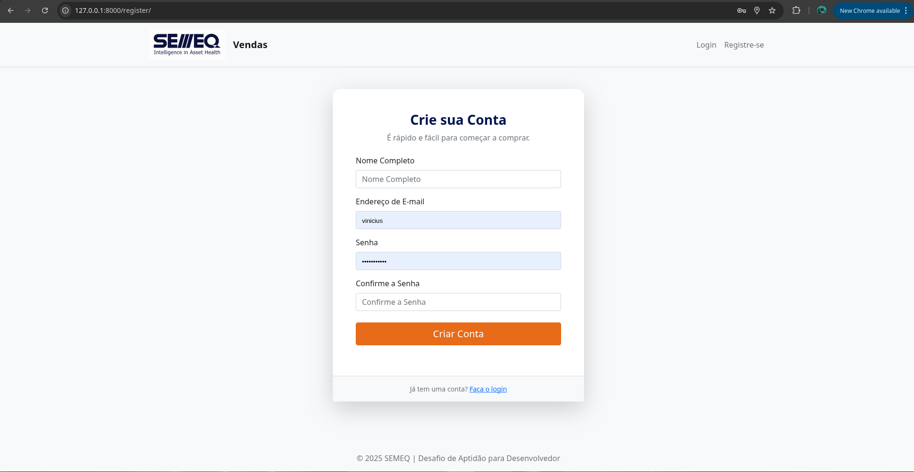
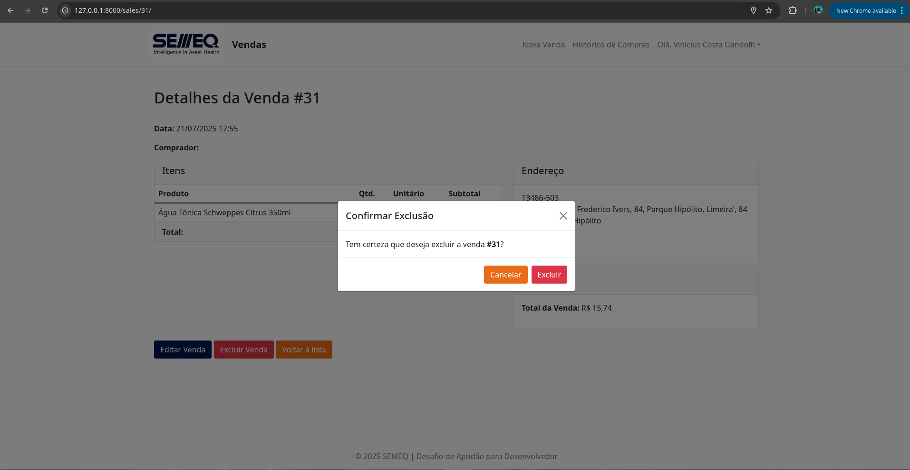
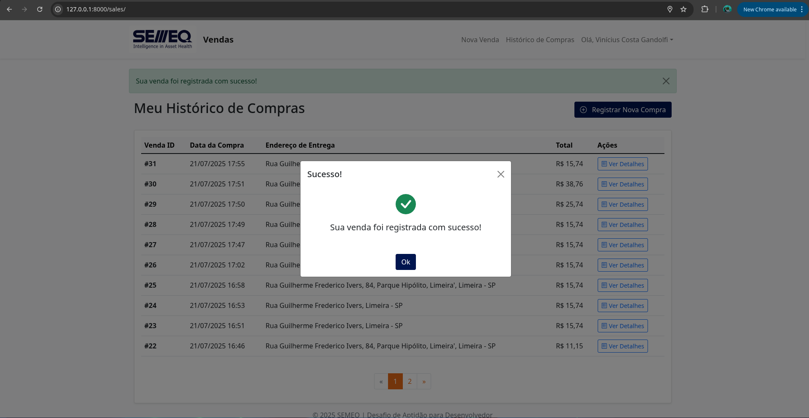
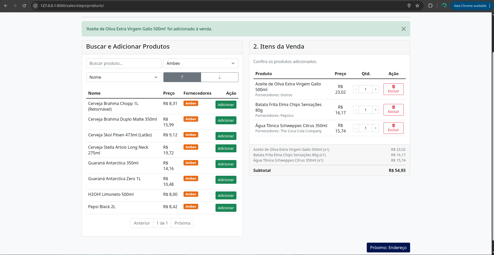
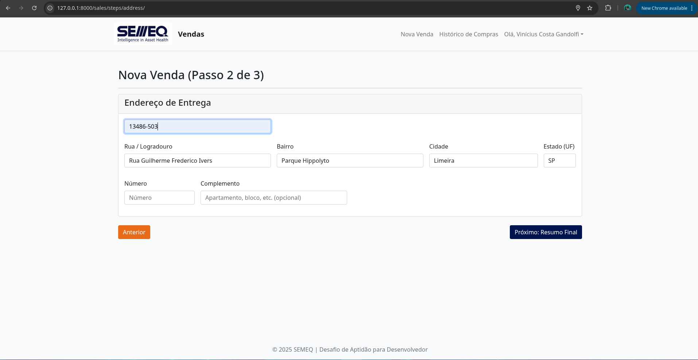
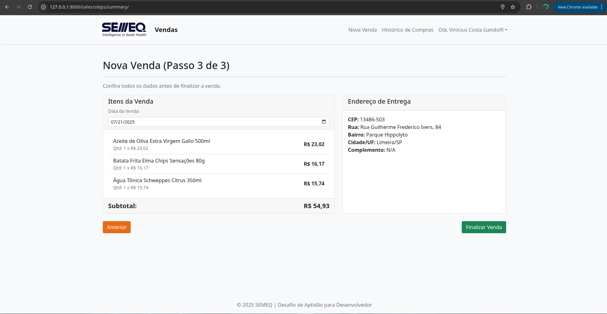

**Portal Stream - Sistema de Vendas**

**Teste de Aptidão para Desenvolvedor – SEMEQ**


## Descrição

Este sistema de vendas permite:

* Registrar vendas com data, endereço de entrega (consultado via API ViaCEP), produtos e comprador.
* Consultar histórico de compras.
* Buscar produtos por nome na tela de consulta.
* Adicionar múltiplos fornecedores a uma venda.
* Atualização dinâmica do subtotal via HTMX, melhorando a experiência do usuário.
* Layout responsivo construído com Bootstrap.

> **Plus:** testes unitários automatizados, linting e tipagem estática.


OBS1: Estou estudando mais sobre arquitetura limpa, e por mais que eu pensasse como usar alguns conceitos do SOLID nesse projeto, o Django já tem padrões muito bem definidos, e forçar outras organizações de pastas apenas complicaria os padrões da própria comunidade.


OBS2: Deu tempo apenas de testes unitários, mas com mais recursos eu poderia adicionar testes de integração, E2E, ou pelo menos alguns testes com banco de dados em memória pra simular alguns cenários.

OBS3: Me parece estranho o desafio pedir para adicionar mais um banco de dados como MongoDB no meio do projeto, isso causaria consitencia eventual dos dados em um app real, além de adicionar latencia, se for a intenção de criar uma "cópia" de um produto na hora de de salvar como SaleItem, uma opção seria utilizar o próprio JSONB do Postgres.


---

## Tecnologias Utilizadas

* **Backend:** Python 3.13, Django, peguei python3.13 apenas pq é uma das últimas versões disponíveis
* **Frontend:** HTML5, Bootstrap 5, HTMX, sómente o HTMX que adicionei em relação da stack sugerida, pois ele complementa bem para um SITE FULLSTACK
* **Banco de dados:** PostgreSQL (via Docker Compose)
* **Contêineres:** Docker, Docker Compose, docker ajuda tanto para utilizar versões de banco de dados diferentes, reprodutividade de ambiente que hoje em dia é imprencindível!
* **Padrão de Código:** Ruff (linting), MyPy (type checking), é dificil padronizar o tipo de código em projetos Python, eu atualmente estou gostando gastante do RUFF, ele padroniza relatiamente fácil os ambientes dos DEVS
* **Testes:** Django TestCase (unidades), cobertura de testes
* **Dependencias:** O padrão da comunidade Python é suar um requirements.txt, entretando ja tive problemas em deploys de um app python por conta das dependencias de dependencias, o pip necessita de um lock file, assim como existe no node, logo to usando a uv, onde guardamos o requirements.in coomo nossas dependencias, e o uv gera o requirements.txt já com os locks das dependencias de dependencias.

uv pip compile requirements.in -o requirements.txt


---

## Requisitos

* Python 3.13+
* Docker & Docker Compose
* Git

---

## Instalação e Setup

1. **Clone o repositório**:

   ```bash
   git clone https://github.com/ViniciusCostaGandolfi/DESAFIO_SEMEC.git
   cd DESAFIO_SEMEC
   ```

2. **Configurar ambiente virtual**:

   ```bash
   python -m venv .venv
   source .venv/bin/activate
   ```

3. **Instalar dependências Python**:

   ```bash
   pip install --upgrade pip
   pip install -r requirements.txt
   ```

4. **Iniciar serviços com Docker Compose**:

   ```bash
   docker-compose up -d
   ```

   Isso irá subir um container PostgreSQL configurado na porta padrão.

5. **Aplicar migrations**:

   ```bash
   python manage.py migrate
   ```

6. **Criar usuário administrador (opcional)**:

   ```bash
   python manage.py createsuperuser
   ```

---

## Executando a Aplicação

* **Modo de desenvolvimento** (auto-reload + lock Python):

  ```bash
  uvicorn core.asgi:application --reload
  ```

  Acesse `http://localhost:8000`.

---

## Testes e Qualidade de Código

* **Executar testes unitários**:

  ```bash
  python manage.py test
  ```

* **Linting com Ruff**:

  ```bash
  ruff check .
  ```

* **Type checking com MyPy**:

  ```bash
  mypy .
  ```

---

## Docker

* **Construir imagem**:

  ```bash
  docker build -t DESAFIO_SEMEC .
  ```

* **Executar contêiner**:

  ```bash
  docker run -p 8000:8000 --env-file .env DESAFIO_SEMEC
  ```

* **Docker Compose completo**:

  ```bash
  docker-compose up --build
  ```

---


## Screenshots

### Autenticação e Gestão

| Tela de Login | Histórico de Vendas | Detalhes da Venda |
| :---: | :---: | :---: |
|  |  |  |

| Tela de Registro | Modal de Exclusão | Modal de Sucesso |
| :---: | :---: | :---: |
|  |  |  |

---

## Fluxo de Criação de Venda (Passo a Passo)

### Passo 1: Seleção de Produtos



---

### Passo 2: Endereço de Entrega



---

### Passo 3: Resumo Final da Venda


